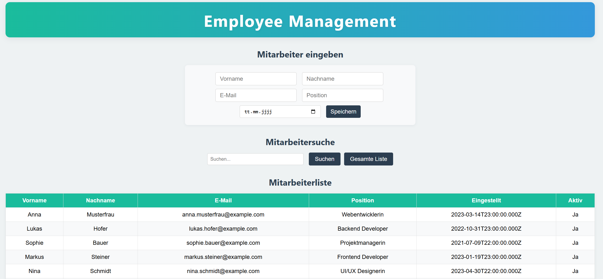

# 🌐 Kern App – Kundendatenverwaltung

Die **Kern App** ist eine einfache Webanwendung zur Verwaltung von Kundendaten mit HTML-Frontend, Express.js-Backend und PostgreSQL-Datenbank.

## 📦 Funktionen

- 📄 HTML-Formular zur Eingabe von Kundendaten
- 🔍 Suchfeld zur Live-Filterung der Daten
- 📋 Tabelle zur Anzeige aller Kunden
- 🚀 REST-API (GET/POST) mit Express.js
- 🗃️ Speicherung in einer PostgreSQL-Datenbank
- 🎨 Basic-CSS-Layout für ein sauberes Frontend
